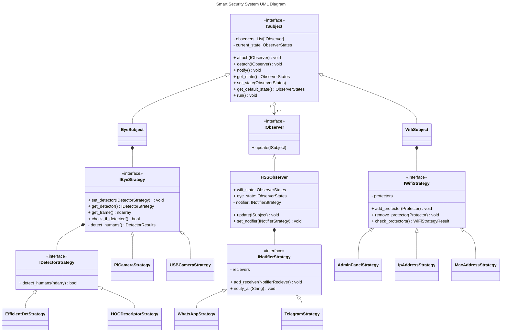

# Home Security System

This project is a home security system that uses a Raspberry Pi and a camera, which detects human presence and sends a message with a picture of the intruder. The system checks connected mac addresses, and if a protector (household member) is home, closes the home security system.


### Hardware Requirements
- Raspberry Pi (an embedded computer)
- Camera (can be anything, I use an old webcam)

### Installation

```bash
$ sudo apt install -y python3-picamera2 libsystemd-dev
$ virtualenv venv
$ source venv/bin/activate
$ pip install -r requirements.txt
$ python hss.py
```

Create a `.config.json` file in the root directory with the following content:

```json
{
    "main_settings": {
        "recievers": [
            {
                "name": "[RECEIVER NAME 1]",
                "tel_no": "[RECEIVER TEL NO 1]",
                "callmebot_key": "[CALLMEBOT_KEY 1]"
            }
        ],
        "protectors": [
            {
                "name": "[PROTECTOR NAME 1]",
                "address": "[PROTECTOR MAC/IP ADDR 1]"
            }
        ]
    },
    "strategy_settings": {
        [...IF NEEDED]
    },
    "file_io_key": "[FILE_IO_KEY]"
}
```

### System Design



### Advice
You can use service file provided to run the script with systemd. It would make it run on startup, and restart it if it crashes.
